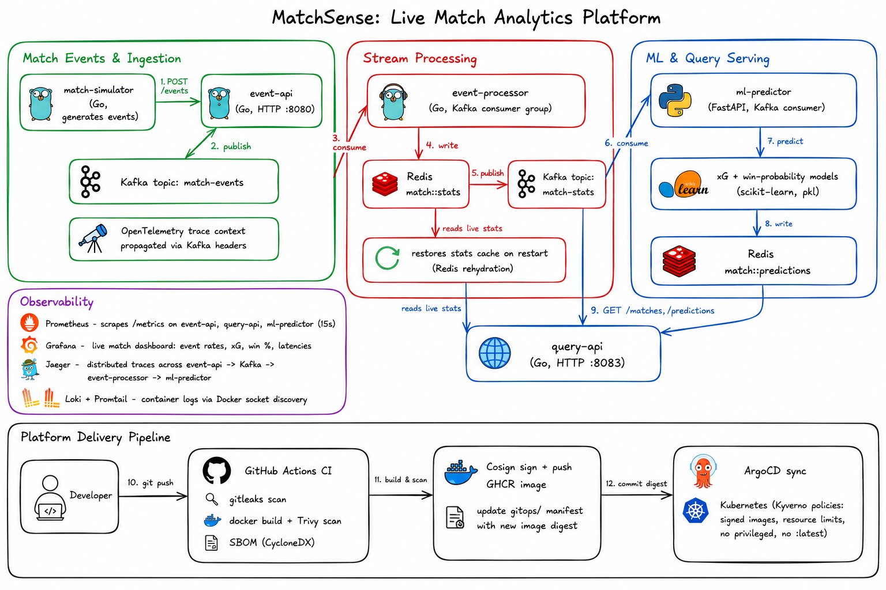

# matchsense

Real-time football (soccer) match analytics pipeline: live match events are
ingested, aggregated into running stats, and fed into ML models for
expected-goals (xG) and win-probability predictions.

## Architecture


- **event-api** (Go) — HTTP ingestion endpoint, publishes events to Kafka
- **event-processor** (Go) — consumes events, maintains running match stats in Redis
- **ml-predictor** (Python/FastAPI) — consumes stats, produces xG and win-probability predictions
- **query-api** (Go) — read API for match stats and predictions
- **match-simulator** (Go) — generates a simulated match for local testing

Observability: Prometheus, Grafana, Loki/Promtail, Jaeger.
Deployment: Kubernetes manifests + Kustomize overlays under `gitops/`, with
ArgoCD app definitions and Kyverno policies.

## Running locally

```bash
docker compose up --build
```

Then:
- `curl http://localhost:8083/matches` — list active matches
- `curl http://localhost:8083/matches/ars-mci-2026` — match stats
- `curl http://localhost:8083/matches/ars-mci-2026/predictions` — latest predictions
- Grafana: http://localhost:3000 (admin / matchsense by default — override with `GRAFANA_ADMIN_PASSWORD`)
- Prometheus: http://localhost:9090
- Jaeger UI: http://localhost:16686

The `match-simulator` service starts generating a simulated Arsenal vs.
Manchester City match automatically. The "MatchSense - Live Match" dashboard
in Grafana is auto-provisioned on startup.

## ML models

Pretrained models live in `ml/models/`. To regenerate training data and
retrain:

```bash
cd ml/train
python generate_xg_data.py
python generate_win_data.py
python train_xg.py
python train_win_prob.py
```

Retrained models need to be copied into `services/ml-predictor/models/`
before rebuilding that service's image.

## Deploying to Kubernetes

See `gitops/`. Each service's CI workflow (`.github/workflows/`) builds,
scans (Trivy), signs (Cosign), and pushes images, then updates the
corresponding `gitops/apps/*/base/deployment.yaml` with the new image
digest for ArgoCD to pick up.
