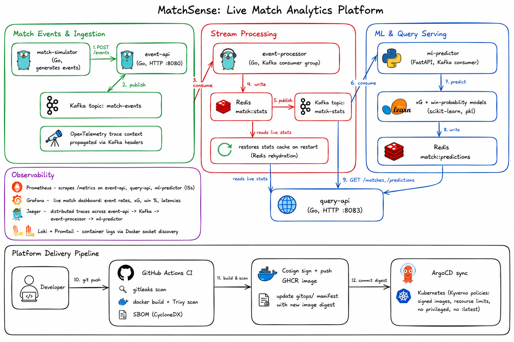

# MatchSense

Real-time football (soccer) match analytics: live match events are ingested,
aggregated into running stats, and fed into ML models that produce
expected-goals (xG) and win-probability predictions — end to end, from a raw
kickoff event to a live Grafana dashboard.

[](https://github.com/nhatminh06/matchsense/actions/workflows/event-api.yaml)
[](https://github.com/nhatminh06/matchsense/actions/workflows/ci.yml)




## What MatchSense does

A simulated match (or a real event feed, if one were wired in) emits events —
goals, shots, fouls, corners, cards — which flow through Kafka into a stats
aggregator, then into an ML prediction service, and out through a read API
and a live Grafana dashboard. The whole path — ingestion, aggregation,
prediction, querying, and observability — is real and running, not mocked.

## Key features

- Real-time event ingestion and stats aggregation over Kafka
- Live xG (expected goals) and win-probability predictions via scikit-learn
  models served from FastAPI
- Full observability: Prometheus metrics, Grafana dashboards, Loki logs,
  Jaeger distributed tracing — wired together with real trace propagation
  across HTTP → Kafka → consumers → Redis
- Kubernetes deployment via Kustomize + ArgoCD (GitOps), with Kyverno
  admission policies enforcing signed images, resource limits, and no
  privileged containers
- Supply-chain security on every image: secret scanning, Trivy CVE
  scanning, SBOM generation, and Cosign keyless signing

## System architecture

| Service | Language | Responsibility | Reads from | Writes to |
|---|---|---|---|---|
| `event-api` | Go | HTTP ingestion endpoint for match events | HTTP `POST /events` | Kafka topic `match-events` |
| `event-processor` | Go | Aggregates events into running match stats | Kafka `match-events` | Redis (`match:*:stats`), Kafka topic `match-stats` |
| `ml-predictor` | Python / FastAPI | Produces xG and win-probability predictions | Kafka `match-stats` | Redis (`match:*:predictions`) |
| `query-api` | Go | Read API for stats and predictions | Redis | HTTP responses |
| `match-simulator` | Go | Generates a simulated match for local/demo use | — | HTTP `POST` to `event-api` |

## Event and data flow

```text
match-simulator ──HTTP──▶ event-api ──Kafka(match-events)──▶ event-processor
                                                                     │
                                                    Redis(match:*:stats)
                                                                     │
                                                       Kafka(match-stats)
                                                                     ▼
                                                              ml-predictor
                                                                     │
                                                  Redis(match:*:predictions)
                                                                     ▼
                                                              query-api ──▶ clients / Grafana
```

Every hop propagates an OpenTelemetry trace context (via Kafka headers), so a
single match event can be followed end to end in Jaeger.

## Technology stack

Go 1.25 · Python 3.11 / FastAPI · scikit-learn · Kafka · Redis · Prometheus ·
Grafana · Loki/Promtail · Jaeger · Docker Compose · Kubernetes · Kustomize ·
ArgoCD · Kyverno · Trivy · Cosign

## Local quick start

**Prerequisites:** Docker and Docker Compose.

```bash
git clone https://github.com/nhatminh06/matchsense.git
cd matchsense
docker compose up --build
```

The `match-simulator` service starts generating a simulated Arsenal vs.
Manchester City match automatically.

## Configuration

Services are configured entirely through environment variables (see
`docker-compose.yaml` for the full local set); there is no separate config
file. Notable ones:

| Variable | Default (local) | Purpose |
|---|---|---|
| `KAFKA_BROKER` | `kafka:29092` | Kafka bootstrap address |
| `REDIS_URL` | `redis:6379` | Redis address |
| `DEDUPE_TTL` | `6h` | How long a processed `event_id` is remembered (event-processor) |
| `SIMULATOR_SEED` | *(unset)* | Fixed seed makes the simulated match reproducible; unset gives a different match each run |
| `SIMULATOR_AUTO_START` | `true` | `false` serves `/health` only, so a test can drive its own events |
| `SIMULATOR_EVENT_INTERVAL` | `2s` | Real time per simulated match-minute (supersedes `SPEED`) |
| `GRAFANA_ADMIN_PASSWORD` | `matchsense` | Grafana admin password |

> The `matchsense` default Grafana password is a **local-development
> convenience only** — it is not safe for any environment reachable outside
> your machine. Kubernetes deployments should override it via a real secret.

## API examples

```bash
curl http://localhost:8083/matches
curl http://localhost:8083/matches/ars-mci-2026
curl http://localhost:8083/matches/ars-mci-2026/predictions
curl -X POST http://localhost:8080/events \
  -H 'Content-Type: application/json' \
  -d '{"match_id":"demo-1","event_type":"shot","team":"Arsenal","player":"Saka","minute":12,"x":88,"y":45,"detail":"on_target"}'
```

`event_id` is optional. Supply your own to make retries idempotent — resending
the same ID is deduplicated rather than double-counted — or omit it and
`event-api` generates one:

```bash
curl -X POST http://localhost:8080/events \
  -H 'Content-Type: application/json' \
  -d '{"event_id":"evt-demo-1-goal-1","match_id":"demo-1","event_type":"goal","team":"Arsenal","player":"Saka","minute":12}'
```

## Testing

All 5 services have unit tests (`go test` for the 4 Go services, `pytest`
for ml-predictor), none of which require Docker, Kafka, or Redis — Kafka
and Redis calls are exercised through small interfaces with fakes
substituted in tests. This is unit coverage of business logic in
isolation, not an end-to-end test of the full pipeline running together.
See [CONTRIBUTING.md](CONTRIBUTING.md) for how to run these locally, and
[docs/local-development.md](docs/local-development.md#test-coverage-status)
for exactly what's covered and what isn't.

## Observability

- **Grafana**: http://localhost:3000 — the "MatchSense - Live Match"
  dashboard is auto-provisioned on startup
- **Prometheus**: http://localhost:9090
- **Jaeger**: http://localhost:16686

See [docs/observability.md](docs/observability.md) for what's actually wired
up (and what isn't — there's no alerting yet).

## ML model workflow

Pretrained models live in `ml/models/`, trained entirely on synthetic,
simulator-generated data — see [Known limitations](#known-limitations).
Training now reports both models' metrics against a naive baseline (not
just an absolute log loss / Brier score with nothing to compare it to)
and writes a `.metadata.json` file recording exactly how each model was
produced; see [docs/ml-pipeline.md](docs/ml-pipeline.md) for what that
does and doesn't demonstrate.

To regenerate training data and retrain (both scripts are seeded and
reproducible, and write a `.metadata.json` file next to each model —
requires **Python 3.11+**, see [docs/ml-pipeline.md](docs/ml-pipeline.md)):

```bash
cd ml/train
python3 -m venv .venv && source .venv/bin/activate
pip install -r requirements.txt

python generate_xg_data.py
python generate_win_data.py
python train_xg.py
python train_win_prob.py
```

Retrained models need to be copied into `services/ml-predictor/models/`
before rebuilding that service's image.

## Kubernetes and GitOps deployment

Deployed via Kustomize manifests under `gitops/` and reconciled by ArgoCD.
See [docs/deployment.md](docs/deployment.md) for the full build → scan →
sign → GitOps-PR → ArgoCD flow, and the rollback procedure.

## Security and software supply chain

Every image is scanned (Trivy, blocking on CRITICAL), has an SBOM generated,
and is signed with Cosign (keyless/OIDC) before Kyverno admission policies
allow it into the cluster — see [docs/security.md](docs/security.md) and
[SECURITY.md](SECURITY.md) for vulnerability reporting.

## Repository structure

```text
services/        Go and Python service source + Dockerfiles
gitops/           Kustomize bases/overlays, ArgoCD Application manifests, Kyverno policies
observability/    Prometheus, Grafana, Loki, Promtail config
ml/               Training data, training scripts, pretrained models
docs/             Architecture, deployment, observability, security, ML docs
.github/          CI workflows, issue/PR templates, Dependabot config
```

## Documentation

- [docs/architecture.md](docs/architecture.md)
- [docs/local-development.md](docs/local-development.md) (includes testing)
- [docs/deployment.md](docs/deployment.md)
- [docs/observability.md](docs/observability.md)
- [docs/security.md](docs/security.md)
- [docs/ml-pipeline.md](docs/ml-pipeline.md)
- [docs/troubleshooting.md](docs/troubleshooting.md)

## Known limitations

- **Simulated events, not a licensed live feed.** `match-simulator`
  generates a synthetic match; there is no integration with a real
  football data provider.
- **At-least-once delivery, not exactly-once.** Kafka can redeliver a
  message after a consumer restart. `event-processor` deduplicates those
  redeliveries by `event_id` so statistics stay correct, but this is
  idempotent handling of at-least-once delivery — not exactly-once
  processing, which this pipeline does not provide. The deduplication
  window is bounded by a TTL (`DEDUPE_TTL`, default 6h): a redelivery
  arriving after it expires would be counted again. Messages that fail to
  parse are routed to a `match-events-dlq` topic rather than silently
  dropped; if that publish also fails after retrying, the message is
  logged and lost — a real, documented double-failure gap, not a claimed
  guarantee. See
  [Event delivery semantics](docs/architecture.md#event-delivery-semantics).
- **Demonstration ML models.** The xG and win-probability models are
  trained entirely on simulator-generated synthetic data, never on real
  match data. Training now evaluates against a naive baseline instead of
  reporting an absolute metric with nothing to compare it to (see
  [docs/ml-pipeline.md](docs/ml-pipeline.md)) — but beating that baseline
  would only show the model learned the simulator's own generating rules.
  It says nothing about accuracy on real football, which has never been
  measured.
- **Single-replica local development.** Every service runs as one
  instance under Docker Compose; this is not a high-availability setup.
- **Redis is a serving store, not durable history.** There's no separate
  analytical/historical data store — Redis holds only the latest stats
  and predictions per match.
- **No alerting.** Prometheus/Grafana provide dashboards and metrics, not
  proactive notification (see [docs/observability.md](docs/observability.md)).
- **Kubernetes deployment is manifests, not a verified cluster run.** The
  Kustomize/ArgoCD/Kyverno setup is real and validated locally
  (`kubectl kustomize` builds cleanly for every overlay), but this
  repository does not claim it has been applied to and verified against a
  live cluster.
- **Security controls demonstrate workflow patterns**, not a complete
  production security program — see [docs/security.md](docs/security.md)
  for exactly what's covered.

## Roadmap

- Add an integration/end-to-end test across the full event-api →
  event-processor → ml-predictor → query-api pipeline
- Add Prometheus alerting rules (dashboards exist; alerts don't yet)
- Evaluate the ML models against real match data, not just synthetic data
- Add API authentication
- Ingest a real event feed instead of only the simulator

## Contributing

See [CONTRIBUTING.md](CONTRIBUTING.md) for local setup, branch/commit
conventions, and the PR workflow.

## Security reporting

See [SECURITY.md](SECURITY.md) — please don't open a public issue for a
suspected vulnerability.

## License

Released under the [MIT License](LICENSE).
